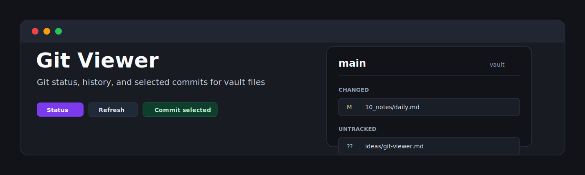
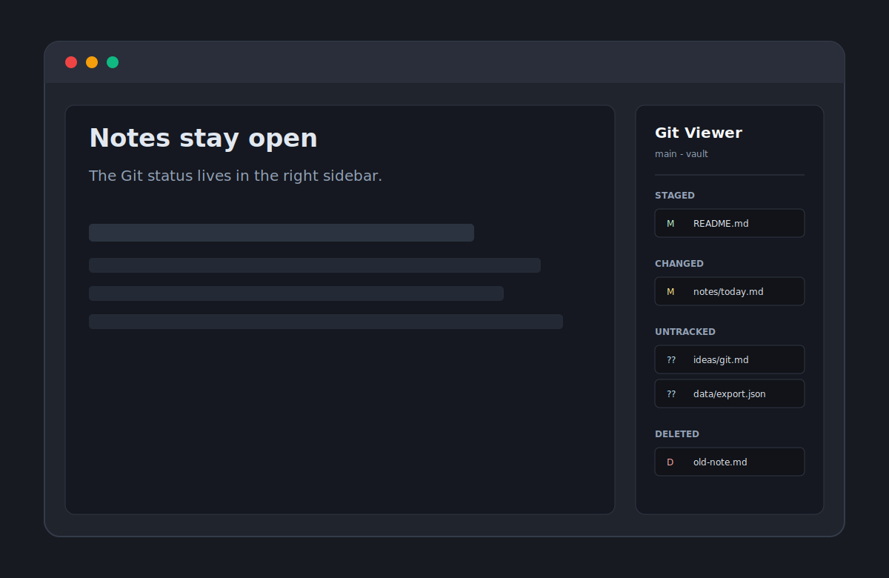

<p align="center">
  
</p>

<p align="center">
  <a href="https://github.com/viggomeesters/obsidian-git-viewer/releases/latest"></a>
  <a href="LICENSE"></a>
  
  
</p>

# Git Viewer

Git Viewer is a lightweight Git status, history, and selected-file commit tool for Obsidian. It is built for people who want to stay inside Obsidian, see exactly which vault files changed, open those files, make intentional commits, and inspect recent commit history without launching a heavier Git client or Visual Studio Code.



## Features

- Shows Git status in a compact Obsidian sidebar view.
- Provides compact **Changes** and **History** tabs.
- Groups files into Staged, Changed, Untracked, Deleted, Renamed, and Conflicted.
- Opens files inside Obsidian when they are inside the current vault.
- Omits hidden/internal Git paths that Obsidian cannot open as vault files.
- Commits only explicitly selected files with a required commit message.
- Uses a temporary Git index for commits so unrelated staged or unstaged files are not included.
- Shows the latest 50 commits with short hash, subject, author, and timestamp.
- Shows read-only commit details with full hash, message body, and changed files.
- Uses local Git porcelain output through the `git` CLI.
- Refreshes manually and after vault file events.
- Makes no network requests from plugin code.

## Non-goals

Git Viewer deliberately does **not** include:

- pull
- clone
- fetch
- merge
- rebase
- branch create/switch/delete
- force push
- push
- stage/unstage
- discard/reset/delete
- conflict resolution
- automatic sync

The plugin is a status and history viewer with one narrow write action: commit selected files. It does not sync, pull, push, or manage branches.

## Roadmap

### Commit selected files

Commit support is intentionally scoped and explicit:

- select files with checkboxes
- enter a commit message
- preview exactly which files will be committed
- commit through a temporary index or equivalent restore-safe strategy
- never accidentally include unrelated staged or unstaged files

Git Viewer does not use a naive `git add <files> && git commit` flow, because that can disturb existing staged state in busy vaults.

## Installation

### Community plugin directory

Git Viewer is ready for submission to the Obsidian Community plugin directory. Once accepted, it can be installed from **Settings -> Community plugins -> Browse** inside Obsidian.

### Manual installation

Until the community directory submission is accepted:

1. Download `main.js`, `manifest.json`, and `styles.css` from the [latest release](https://github.com/viggomeesters/obsidian-git-viewer/releases/latest).
2. Create this folder in your vault: `.obsidian/plugins/git-viewer/`.
3. Put the downloaded files in that folder.
4. Reload Obsidian.
5. Enable **Git Viewer** in **Settings -> Community plugins**.

### BRAT installation

For beta testing, install the plugin with [BRAT](https://github.com/TfTHacker/obsidian42-brat) using this repository URL:

```text
https://github.com/viggomeesters/obsidian-git-viewer
```

## Usage

Open the command palette and run **Open Git Viewer**, or click the Git Viewer ribbon icon. The view opens in the right sidebar.

Use **Changes** to review and commit current working-tree changes. Use **History** to inspect recent local commits.

Click a file path to open it in Obsidian. Deleted files and files outside the current vault cannot be opened.

To commit:

1. Select one or more visible status rows, or use **Select all**.
2. Write a commit message.
3. Click **Commit selected**.

The commit includes only the selected paths. Unselected staged files remain staged.

After a commit, Git Viewer shows a **Last commit** banner with a **View in History** shortcut. History remains read-only and uses local Git data only.

## Development

```bash
npm install
npm run build
npm run lint
npx tsc --noEmit
npm test
```

For local development, copy or symlink this repository into `.obsidian/plugins/git-viewer/` inside a Git-backed Obsidian test vault.

## Release process

Obsidian installs community plugin files from GitHub releases. For each release:

1. Update `manifest.json`, `package.json`, and `versions.json` when the plugin version or minimum Obsidian version changes.
2. Run `npm install`, `npm run build`, `npm run lint`, `npx tsc --noEmit`, and `npm test`.
3. Create a GitHub release whose tag exactly matches `manifest.json.version`.
4. Attach `main.js`, `manifest.json`, and `styles.css` as release assets.

The repository includes a GitHub Actions release workflow with artifact attestation support. If GitHub Actions is disabled for the owner account, manual releases are still usable for Obsidian, but the Community automated review may show a recommendation about missing artifact attestations.

## Community directory submission

The repository is prepared for Obsidian Community plugin submission. The remaining submission step must be completed by the repository owner in the Obsidian Community site because it requires signing in, linking GitHub, and confirming the developer policies/support commitment.

Submit this repository URL:

```text
https://github.com/viggomeesters/obsidian-git-viewer
```

The current release is ready for review:

- root `README.md`, `LICENSE`, and `manifest.json` exist
- `manifest.json.id` is `git-viewer`
- `manifest.json.version` is `0.3.0`
- `versions.json` maps `0.3.0` to Obsidian `1.5.0`
- GitHub release `0.3.0` should include `main.js`, `manifest.json`, and `styles.css`

Official references:

- [Submit your plugin](https://docs.obsidian.md/Plugins/Releasing/Submit%20your%20plugin)
- [Manifest](https://docs.obsidian.md/Reference/Manifest)
- [Obsidian releases repository](https://github.com/obsidianmd/obsidian-releases)

## Security and privacy

Git Viewer runs local `git` commands against the current vault or repository. It does not make network requests and does not use clipboard APIs.

History is read-only and uses local `git log` and `git show --name-status`. The only write action is **Commit selected**. It creates a commit from explicitly selected paths through a temporary Git index, then refreshes the selected paths in the real index after the branch is advanced. It does not pull, push, clone, fetch, merge, rebase, discard, reset, or manage branches.

## License

[MIT](LICENSE)
